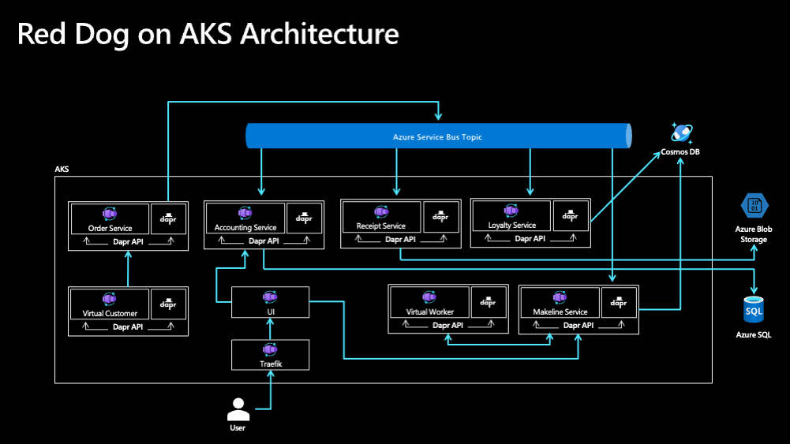

# Red Dog Demo - AKS Deployment

## Background

This repository leverages the [reddog applicaton codebase](https://github.com/Azure/reddog-code) and was created to help users deploy a comprehensive, microservice-based sample application to Azure. 

## Getting Started

This repo contains the scripts and configurations to deploy the Red Dog Demo along with the backing Azure Resources. Here's how to get started: 

* If you plan to make any code changes or contribute, we suggest you fork the repo first
* Create an GitHub Codespace 
* Create a `config.json` file based on the example in the repo and update values accordingly
* Execute the `start.sh` deployment script.

The `cleanup.sh` script will remove local log files and certs, but it does not delete the Resource Group. 

## Architecture

This repository leverages bicep templates in order to execute the deployment of the Reddog applicaton and the supporting Azure Infrastructure. Bicep is a Domain Specific Language (DSL) for deploying Azure resources declaratively and provides a transparent abstraction over ARM and ARM templates.  

### Infrastructure Components

#### Resource Group
A logical container which holds all resources needed to run the above solution in Azure

#### AKS Cluster
The application microservices will run in this cluster

#### Azure Service Bus 
A fully managed enterprise message broker with message queues and publish-subscribe topics used as the Dapr PubSub component implementation. This component is leveraged by multiple services, with the Order Service publishing messages to four other services in the application: Makelike, Accounting, Loyalty and Receipt

#### Azure SQL DB 
A member of the Azure SQL family, Azure SQL supports modern cloud applications on an intelligent, managed database service. This resource is created for the Accounting Service, which makes use of EF Core for interfacing with the DB. 

#### Azure Blob Storage 
Azuree Blob storage is optimized for storing massive amounts of unstructured data. Unstructured data is data that doesn't adhere to a particular data model or definition, such as text or binary data. Blob storage is used by the Receipt Service via Dapr Output Bindings to store order receipts.

## Contributing

This project welcomes contributions and suggestions.  Most contributions require you to agree to a
Contributor License Agreement (CLA) declaring that you have the right to, and actually do, grant us
the rights to use your contribution. For details, visit https://cla.opensource.microsoft.com.

When you submit a pull request, a CLA bot will automatically determine whether you need to provide
a CLA and decorate the PR appropriately (e.g., status check, comment). Simply follow the instructions
provided by the bot. You will only need to do this once across all repos using our CLA.

This project has adopted the [Microsoft Open Source Code of Conduct](https://opensource.microsoft.com/codeofconduct/).
For more information see the [Code of Conduct FAQ](https://opensource.microsoft.com/codeofconduct/faq/) or
contact [opencode@microsoft.com](mailto:opencode@microsoft.com) with any additional questions or comments.